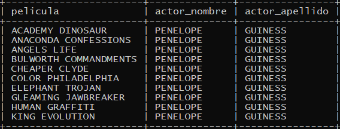
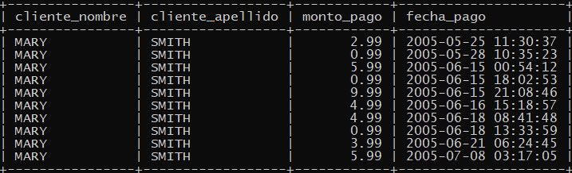
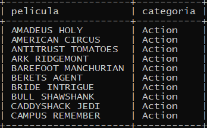
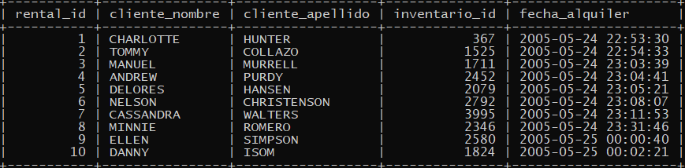
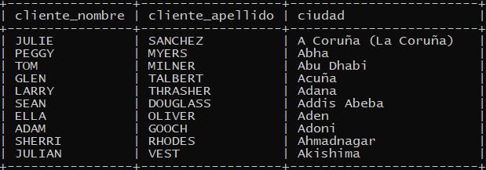
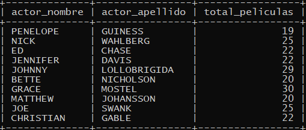
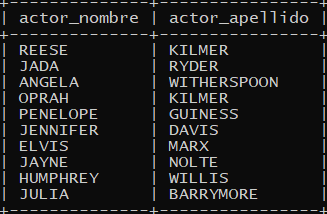

# Consultas SQL - Karen Cristancho

## Consultas INNER JOIN

- Obtener detalles de las películas y los actores que las interpretan

````sql
SELECT f.title AS pelicula, a.first_name AS actor_nombre, a.last_name AS actor_apellido
FROM film f
INNER JOIN film_actor fa ON f.film_id = fa.film_id
INNER JOIN actor a ON fa.actor_id = a.actor_id
LIMIT 10;
````


- Listar clientes y sus pagos

````sql
SELECT c.first_name AS cliente_nombre, c.last_name AS cliente_apellido, p.amount AS monto_pago, p.payment_date AS fecha_pago
FROM customer c
INNER JOIN payment p ON c.customer_id = p.customer_id
LIMIT 10;
````


- Mostrar películas y su categoría

````sql
SELECT f.title AS pelicula, c.name AS categoria
FROM film f
INNER JOIN film_category fc ON f.film_id = fc.film_id
INNER JOIN category c ON fc.category_id = c.category_id
LIMIT 10;
````


- Obtener alquileres con detalles de cliente e inventario

````sql
SELECT r.rental_id, c.first_name AS cliente_nombre, c.last_name AS cliente_apellido, i.inventory_id AS inventario_id, r.rental_date AS fecha_alquiler
FROM rental r
INNER JOIN customer c ON r.customer_id = c.customer_id
INNER JOIN inventory i ON r.inventory_id = i.inventory_id
LIMIT 10;
````


- Listar ciudades y clientes asociados

````sql
SELECT c.first_name AS cliente_nombre, c.last_name AS cliente_apellido, ci.city AS ciudad
FROM customer c
INNER JOIN address a ON c.address_id = a.address_id
INNER JOIN city ci ON a.city_id = ci.city_id
LIMIT 10;
````


## Procedimientos

- Listar actores con un número mínimo de películas

````sql
DELIMITER //
CREATE PROCEDURE ActoresConMinimoPeliculas(IN minimo INT)
BEGIN
    SELECT a.first_name AS actor_nombre, a.last_name AS actor_apellido, COUNT(fa.film_id) AS total_peliculas
    FROM actor a
    INNER JOIN film_actor fa ON a.actor_id = fa.actor_id
    GROUP BY a.actor_id
    HAVING total_peliculas >= minimo
    LIMIT 10;
END //
DELIMITER ;

CALL ActoresConMinimoPeliculas(5);
````


- Obtener actores de películas de una categoría específica

````sql
DELIMITER //
CREATE PROCEDURE ActoresPorCategoria(IN categoria_id INT)
BEGIN
    SELECT DISTINCT a.first_name AS actor_nombre, a.last_name AS actor_apellido
    FROM actor a
    INNER JOIN film_actor fa ON a.actor_id = fa.actor_id
    INNER JOIN film f ON fa.film_id = f.film_id
    INNER JOIN film_category fc ON f.film_id = fc.film_id
    WHERE fc.category_id = categoria_id
    LIMIT 10;
END //
DELIMITER ;

CALL ActoresPorCategoria(2);
````
